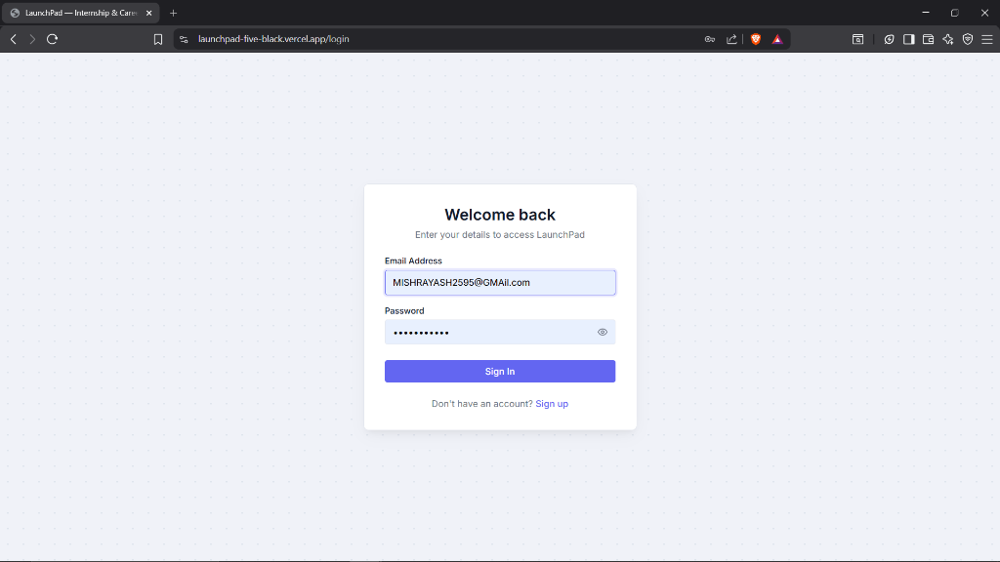
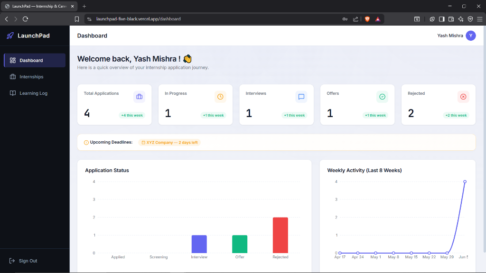
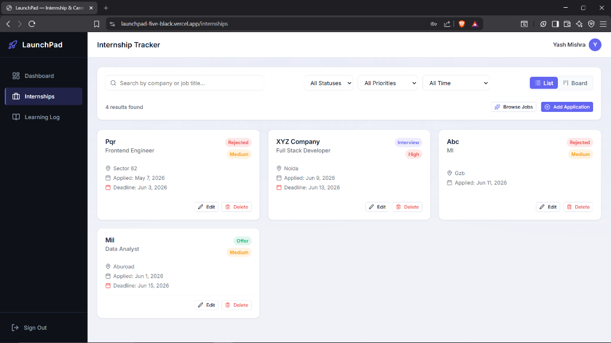
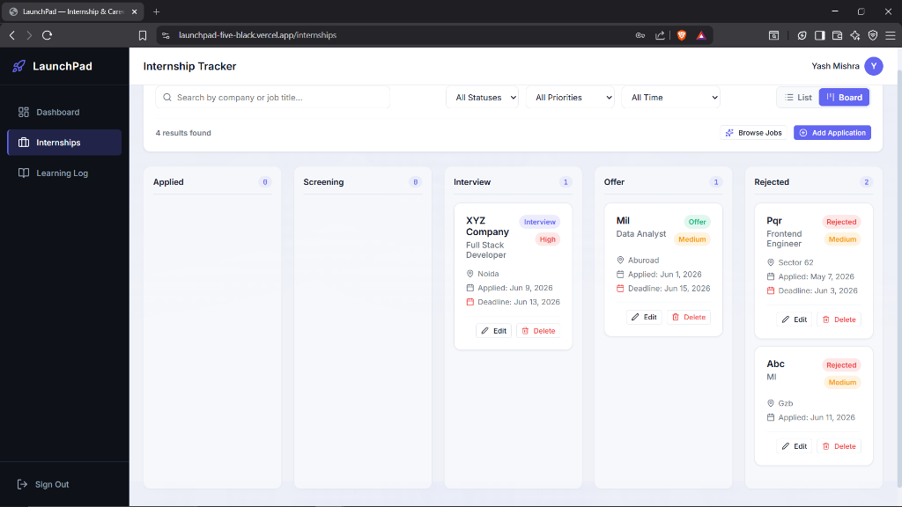
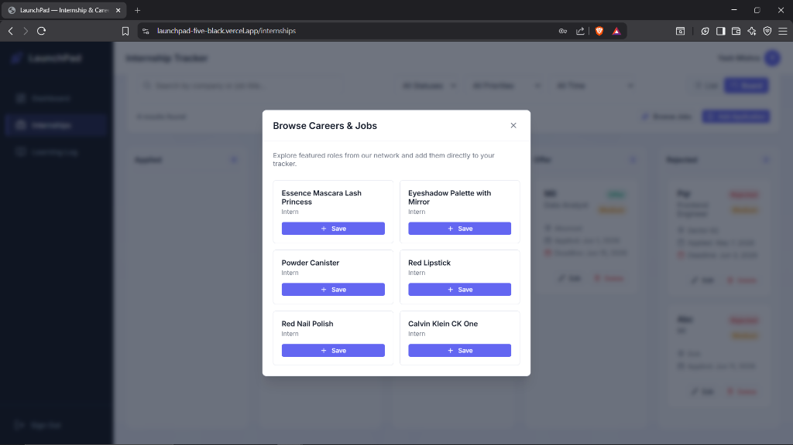

# LaunchPad - Student Internship & Career Tracker

### 🔗 Project Links
- **GitHub Repository:** https://github.com/yash2595/launchpad
- **Live Deployment:** https://launchpad-five-black.vercel.app

LaunchPad is a full-stack web application built to help college students manage their internship search. Instead of using confusing spreadsheets or notes, students can visually track applications, get alerted for upcoming deadlines, and log their learning progress in one clean interface.

The project is built using a React frontend, Redux for state management, and Supabase for database and authentication.

## 📸 Screenshots

### 🔑 Authentication / Login Page


### 📊 Dashboard Overview


### 📋 Internship Tracker (List View)


### 🗂️ Internship Board (Kanban View)


### 🔍 Browse Jobs Modal (External API Integration)


## Core Features

- **Dashboard:** A central dashboard showing stats like Total Applications, Applications In progress, Interviews scheduled, Offers received, and Rejections. It has simple charts mapping your status distribution and weekly application activity.
- **Board View:** A drag-and-drop board where you can visually move job applications across different columns (Applied, Screening, Interview, Offer, Rejected) as your status changes.
- **Learning Log:** A tracker to log skills you are studying (Frontend, Backend, DSA, etc.) using interactive progress sliders. Once progress reaches 100%, the status changes to "Mastered".
- **Browse Jobs:** Search and import jobs using an external GET API (DummyJSON) with a shimmer loading state.
- **Real Auth:** Users can register, verify their email via a Supabase confirmation link, and log in securely. All routes are protected.

## Technical Details & API Integration

- **Frontend & State:** Developed using React JS (scaffolded with Vite) and React Router v6. Redux Toolkit manages the global state and persists application data to `localStorage` so it is saved even if you close the browser.
- **API GET:** Fetches mock job listings from the `DummyJSON` API (`https://dummyjson.com/products?limit=6`) using Axios.
- **API POST:** Fulfills the POST API requirement by sending a real POST request to `JSONPlaceholder` (`https://jsonplaceholder.typicode.com/posts`) when a student adds a new learning skill to the tracker.
- **Styling:** Custom CSS Modules are used for styling to keep things lightweight, scoped, and clean. No Tailwind or third-party UI libraries were used.

## Setup Instructions

### 1. Install Dependencies
```bash
npm install
```

### 2. Configure Environment variables
Create a `.env` file in the root of the project and add your Supabase credentials:
```env
VITE_SUPABASE_URL=https://your-project-ref.supabase.co
VITE_SUPABASE_ANON_KEY=your-anon-key
```

### 3. Setup Database Tables
Go to your Supabase project dashboard, open the **SQL Editor**, and run the SQL code inside the `schema.sql` file located in the root of this project. This will create the `profiles` and `internships` tables, triggers, and RLS policies.

### 4. Run the App
```bash
npm run dev
```

